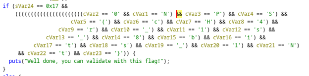
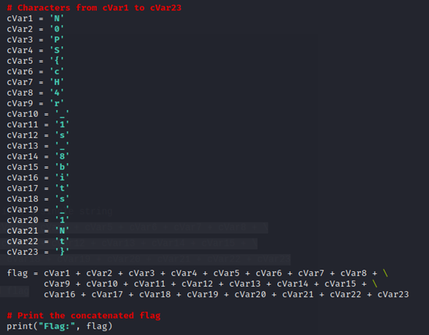

<h1>Challenge1 : readme</h1>

  
We are given a file called main. It is an elf binary. Open the code in Ghidra. When inspecting the code the main function has an interesting If condition.

   
  

    
    
if condition that shows different variables assigned with different characters.

  

   
  

    
    
Printing all the variables.

  

   
  
Flag: NOPS{cH4r_1s_8bits_1Nt}

