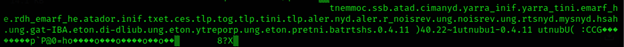
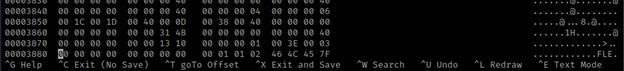
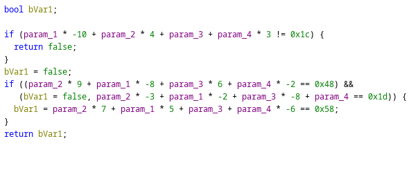
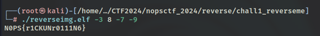

<h1>Challenge2 : Reverse me</h1>

  
This challenge had an img.jpg. Open the image and check its contents. The image could not be opened properly, and had some format errors. Perform a cat on the img.

   
  

    
    
The contents of the file looked in reverse. Tini -> init.

  

   
  

    
    
Hex values of the file.

  

   
  
Run the hexeditor tool on the image to check its bytes. The bytes are in reverse order .FLE -> ELF. The next step is to invert the image, so reverse it byte to byte. 
    When you reverse the byes, the file is actually an elf binary. Reversing the byte can be done by using a simple python code. After reversing, use Ghidra to analyze 
    the binary code.

   
  

    
    
Function with if conditions.

  

   
  
One of the functions shows 4 conditions. If all satisfied then bvar1 will be returned with a value. There are 4 parameters taken into the function and if conditions are 
    satisfied, the bvar1 value will be returned. If the elf code is simply executed, nothing is returned. The binary requires 4 inputs. The four conditions are linear 
    equations. Python can be used to solve them which gives the following values: -3, 8, -7, -9. Input these values into the executable.
  

   
  

    
    
Flag revealed.

  

   
  
Flag: N0PS{r1CKUNr0111N6}

