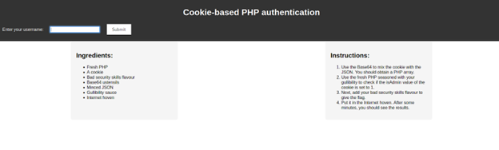
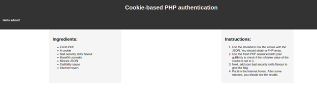
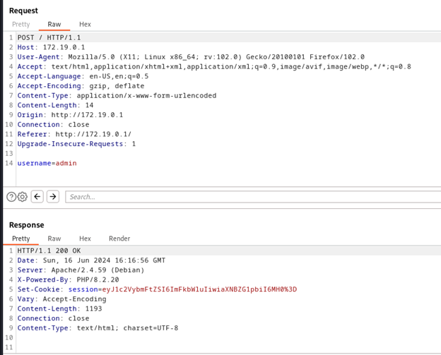
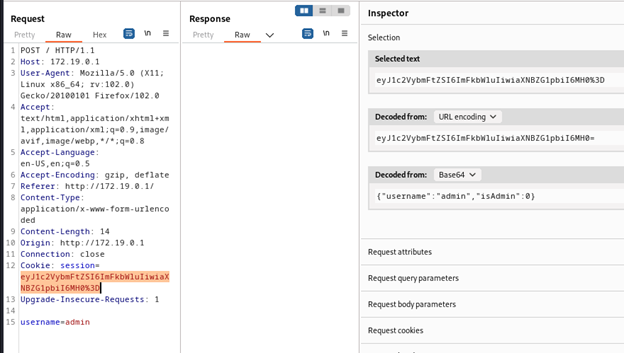
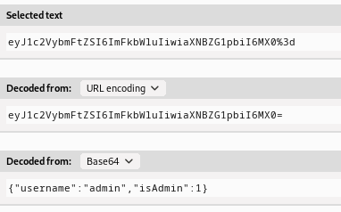
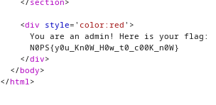

<h1>Challenge 1: Web-hook</h1>

  
A website link is given to us. It has a text field accepts an input.

  

    
    
Webpage look.

  

  

    
    
Webpage look after inserting admin as username.

  

   
  
When a username is inserted, the webpage displays the follwing messgae: Hello (username)! Step 1 for Web CTF is to inspect the source code of the webpage. In this case there was nothing suspicious found. The instruction section on the right side of the webpage suggests checking the admin cookie. Burp Suit is a handy tool when it comes to inspecting website headers.

   
  

    
    
Burp Suit intercepting the response after inputing a username into the textfield.

  

   
  
Turn on Burp Suit interception and enter a username on the website. The response has a cookie. After getting the session cookie. Now as the admin, reload the page. Keep the interception on in Burp Suit. The same cookie is used to communicate with the server. Send that request to the repeater. In the repeater cookie values can be edited.

   
  

    
    
Cookie session ID decoded, reveals the value of isAdmin.

  

  

    
    
Cookie session ID modifed. isAdmin value chanegd to 1.

  

   
  

    The decoded version of the cookie is a json string. Change the admin value to 1. The encoded cookie value will also change. Send this modified cookie to the server.
  

   
  

    
    
Flag revealed.

  

   
  
In response, the server assumes it is the admin accessing, hence the flag is revealed.

  
Flag: NØPS{y0u_Kn0W_HØw_t0_c00K_n0W}

