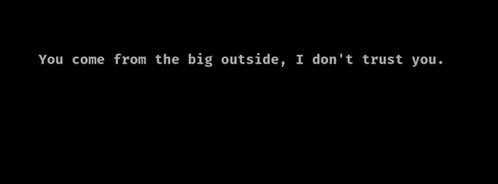
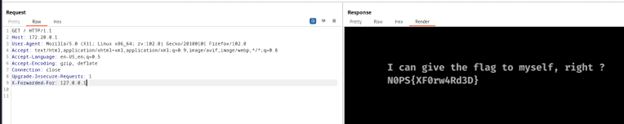

<h1>Challenge2 : Outsider</h1>

  

    
    
Webpage look.

  

  
The website given to us is a simple, easy website with a moving message. Nothing suspicious in the source code. But the message acts as a hint. The server does not trust anyone from the outside, if the connection is coming from internal then the server will trust it. Manipulating headers is a task done by BurpSuit. Turn on the interceptor and reload the webpage. Capture the request and send it to the repeater.

  
Basic hint is that anything contacting from the outside, the server does not trust. Talking from the inside of a machine is basically local host 127.0.0.1. Use the X-Forwarded-For request header. This header is used to find out the client’s IP Address from the server’s side. Typically used for logging. When the client sends a request to a web server through a proxy, this header is used by the proxy. Proxy adds the client’s IP address to the X-Forwarded-For header. It is a deliberate design feature to let the server know the client’s IP address. This header can be exploited. Untrusted proxies can add IP addresses leading to the web server getting false client information. This loophole can be exploited, by tricking the web server to assume that the client is its own localhost. 
 
Add the X-Forwarded-For: 127.0.0.1 tag to the request header and send it to the server. The webpage will reveal the flag.

 
  

    
    
Flag revealed.

  

 
  

    Flag: N0PS{XF0rw4Rd3D}
  

